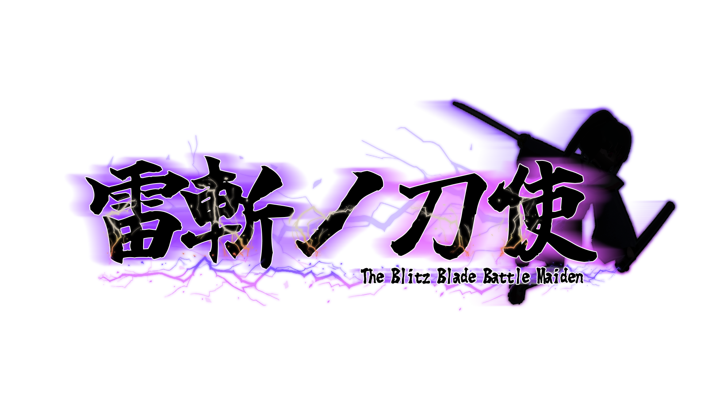
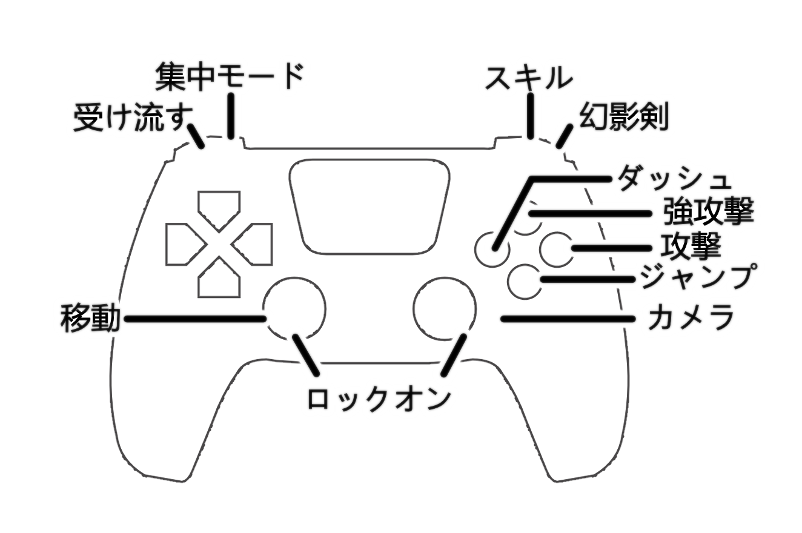
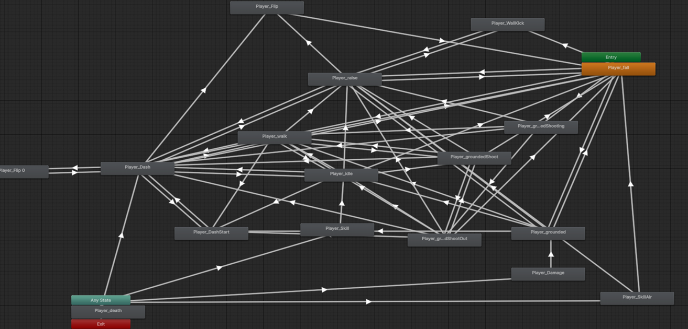
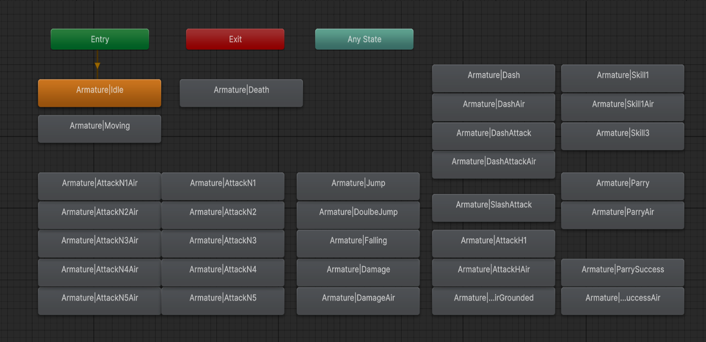

# 雷斬ノ刀使

  

> ※ 本リポジトリはコード閲覧用です（C# スクリプトのみを公開）。

| | |
|---|---|
| ジャンル | 3Dアクション |
| エンジン | Unity |
| 開発規模 | 個人開発 |
| 開発期間 | 2026.1-2026.3 |
| プラットフォーム | Windows |
| リリース | [itch.io](https://nzm6230.itch.io/the-blitz-blade-battle-maiden) |

▶️ プレイ動画
https://youtu.be/s4_MZjZC8do

## ゲーム概要
パリィで攻撃を受け流し、スキルで敵を一掃する。爽快な剣戟ハイスピード和風3D アクション。

刀使いの少女となり、呪霊を倒し、呪域となった世界を元に戻せ。

## 操作方法

  

## スキル攻撃
紫電一閃　R2 + 〇

桜華疾走　R2 + □

落花ノ構え　R2 + X

千雷刃　R2 + △

受け流し R1

## 設計・アーキテクチャ

本作は **拡張性** と **開発効率** を重視し、約3ヶ月・個人で完成させた。
プログラマー視点での主な設計上の工夫は以下の4点。

### 1. State Machine による状態管理
プレイヤーの18種類の状態（待機・移動・攻撃・ダッシュ・各スキル等）を `StateBase` を継承した個別クラスに分離。`PlayerBehaviour` は `currentState` のイベントを呼ぶだけの構造とし、`if` 文の肥大化を解消した。
**新規アクションの追加は State クラスを1つ足すだけで完結し、`PlayerBehaviour` 本体は修正不要。**
- 基底クラス: [`StateBase.cs`](./script/Core/StateMachine/StateBase.cs)
- 状態クラス群: [`script/Player/State/`](./script/Player/State/)
- 呼び出し側: [`PlayerBehaviour.cs`](./script/Player/PlayerBehaviour.cs)

### 2. ScriptableObject によるデータ駆動攻撃システム
攻撃ロジックをハードコーディングせず、攻撃データ（攻撃力・入力受付/判定フレーム・エフェクト等、約25項目）を ScriptableObject に外部化。コンボの順序入替や数値調整は **再コンパイル不要で Inspector 上から完結** し、プログラマー以外でも調整できる。
- 攻撃データ: [`PlayerAttackSObj.cs`](./script/ScriptableObject/PlayerAttackSObj.cs)
- コンボ定義: [`PlayerComboListSObj.cs`](./script/ScriptableObject/PlayerComboListSObj.cs)

### 3. Interface による拡張設計
攻撃対象・被ダメージ・ロックオン対象を Interface で抽象化。新しい対象クラスは同じ Interface を実装するだけで対応でき、**既存の攻撃側コードは一切修正不要。**
- [`IAttackable`](./script/Core/Interface/IAttackable.cs)（プレイヤーが攻撃できる対象）
- [`IDamageable`](./script/Core/Interface/IDamageable.cs)（プレイヤーにダメージを与える対象）
- [`ITaggableObject`](./script/Core/Interface/ITaggableObject.cs)（ワープ攻撃のロックオン対象）
- 実装例: [`EnemyProperty.cs`](./script/Enemy/State/EnemyProperty.cs) / [`EnemyAttackHealItem.cs`](./script/Enemy/Attack/EnemyAttackHealItem.cs)

### 4. Animator 脱却（遷移のコード制御）
状態遷移を State Machine 側で管理するため、Animator Controller では遷移条件を組まない。Animator は「クリップを再生する器」に役割を限定し、遷移は各状態の Enter 時に `Animator.Play()` / `CrossFade()` を呼ぶ方式に統一。遷移ロジックがコード一箇所に集約され、グラフのスパゲッティ化を解消した。

## 制作者

NZM — [itch.io](https://nzm6230.itch.io) ・ [GitHub](https://github.com/CCHei6230) 

## 使用アセット
DOTween (HOTween v2)
https://assetstore.unity.com/packages/tools/animation/dotween-hotween-v2-27676

Eflatun.SceneReference
https://github.com/starikcetin/Eflatun.SceneReference

MK Toon - Stylized Shader
https://assetstore.unity.com/packages/vfx/shaders/mk-toon-stylized-shader-178415

Vefects

https://assetstore.unity.com/packages/vfx/stylized-fire-urp-355834

https://assetstore.unity.com/packages/vfx/particles/spells/zap-vfx-urp-303479

https://assetstore.unity.com/packages/vfx/shaders/easy-impact-frames-urp-355378

Simple Sky
https://assetstore.unity.com/packages/3d/environments/simple-sky-cartoon-assets-42373

AmbientCG
https://ambientcg.com/

EffectTextureMaker
https://mebiusbox.github.io/contents/EffectTextureMaker/

刀 3D モデル (BOOTH)
https://booth.pm/ja/items/7369613

玉ねぎ楷書「激」
https://booth.pm/ja/items/2929647

効果音ラボ
https://soundeffect-lab.info/

Thunder Storm (DOVA)
https://dova-s.jp/bgm/detail/11432

Kenny UI
https://kenney.nl/assets/tag:interface

